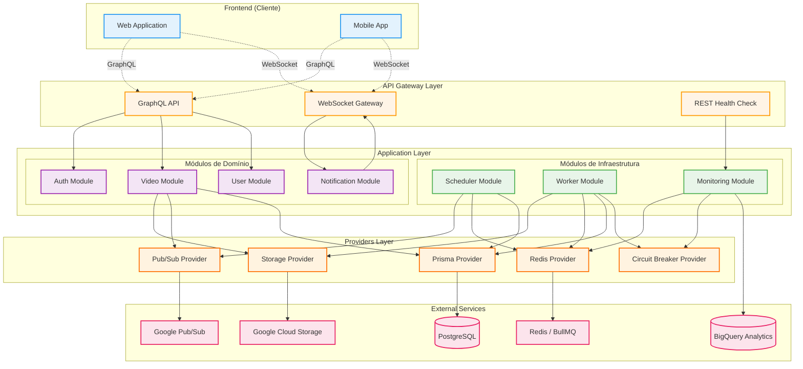

# Diagrama de Componentes

## 📖 Visão Geral

Arquitetura de componentes mostrando a organização modular do sistema.

## 🏗️ Arquitetura de Componentes



## 📦 Detalhamento dos Componentes

### Frontend Layer

#### Web Application
- **Tecnologia:** React/Vue/Angular
- **Responsabilidades:**
  - Interface de upload de vídeos
  - Listagem e visualização de vídeos
  - Recebe notificações via WebSocket
- **Comunicação:** GraphQL + WebSocket

#### Mobile App
- **Tecnologia:** React Native / Flutter
- **Responsabilidades:**
  - Upload de vídeos da galeria
  - Notificações push
  - Visualização de vídeos processados

### API Gateway Layer

#### GraphQL API
- **Framework:** NestJS + Apollo Server
- **Porta:** 3002
- **Responsabilidades:**
  - Endpoint único para queries e mutations
  - Validação de entrada
  - Autenticação JWT
- **Schema:** [Ver documentação](../api/graphql-schema.md)

#### WebSocket Gateway
- **Tecnologia:** Socket.IO
- **Namespace:** `/notifications`
- **Responsabilidades:**
  - Comunicação bidirecional em tempo real
  - Notificações de progresso
  - Eventos de conclusão/falha

#### REST Health Check
- **Endpoints:**
  - `GET /health` - Status geral
  - `GET /health/breakers` - Circuit breakers
  - `GET /notifications/stats` - Conexões WS

### Application Layer

#### Módulos de Domínio

**Auth Module**
```
auth/
├── auth.module.ts
├── auth.resolver.ts (GraphQL)
├── auth.service.ts
├── guards/
│   ├── gql-auth.guard.ts
│   └── jwt-auth.guard.ts
└── strategies/
    └── jwt.strategy.ts
```

**Video Module**
```
video/
├── video.module.ts
├── video.resolver.ts
├── video.service.ts
└── graphql/
    ├── inputs/
    └── types/
```

**User Module**
```
user/
├── user.module.ts
├── user.resolver.ts
├── user.service.ts
└── graphql/
```

**Notification Module**
```
notification/
├── notification.module.ts
├── notification.gateway.ts (WebSocket)
├── notification.service.ts
└── listeners/
    └── video-processed.listener.ts
```

#### Módulos de Infraestrutura

**Scheduler Module**
```
scheduler/
├── scheduler.module.ts
├── scheduler.service.ts (Pub/Sub Subscriber)
└── strategies/
    ├── priority.strategy.ts
    └── delay.strategy.ts
```

**Worker Module**
```
worker/
├── worker.module.ts
├── processors/
│   ├── video-processor.worker.ts
│   ├── transcode.worker.ts
│   ├── audio.worker.ts
│   └── thumbnail.worker.ts
└── services/
    ├── ffmpeg.service.ts
    └── video-flow.service.ts
```

**Monitoring Module**
```
monitoring/
├── monitoring.module.ts
├── monitoring.resolver.ts
├── metrics.service.ts
└── services/
    ├── sla-tracker.service.ts
    └── circuit-breaker-metrics.service.ts
```

### Providers Layer

#### Storage Provider
```typescript
@Injectable()
export class StorageProvider {
  // Integração com Google Cloud Storage
  uploadRaw(userId, file): Promise<string>
  uploadProcessed(userId, file): Promise<string>
  downloadRaw(gcsPath, destPath): Promise<void>
  getSignedUrl(gcsPath): Promise<string>
}
```

#### Pub/Sub Provider
```typescript
@Injectable()
export class PubSubProvider {
  // Integração com Google Pub/Sub
  publishVideoReceived(data): Promise<string>
  publishVideoProcessed(data): Promise<string>
  subscribe(subscriptionName, handler): void
}
```

#### Redis Provider
```typescript
@Injectable()
export class RedisProvider {
  // Cliente Redis compartilhado
  getClient(): Redis
  set(key, value): Promise<void>
  get(key): Promise<string>
}
```

#### Prisma Provider
```typescript
@Injectable()
export class PrismaProvider extends PrismaClient {
  // ORM para PostgreSQL
  // Modelos: User, Video, VideoJob, AuditLog, SLAMetric
}
```

#### Circuit Breaker Provider
```typescript
@Injectable()
export class CircuitBreakerProvider {
  // Gerenciamento de circuit breakers
  createBreaker(name, action, options): CircuitBreaker
  getBreaker(name): CircuitBreaker
  getStatus(name): Promise<Status>
  getAllStatus(): Promise<Status[]>
}
```

## 🔗 Relações entre Componentes

### Dependências Principais

| Módulo | Depende De |
|--------|------------|
| **Video Module** | Storage, Pub/Sub, Prisma |
| **Scheduler Module** | Pub/Sub, Redis, Prisma |
| **Worker Module** | Storage, Redis, Prisma, Circuit Breaker |
| **Notification Module** | WebSocket Gateway |
| **Monitoring Module** | Redis, Circuit Breaker, Prisma |

### Comunicação Assíncrona

```
Video Service → Pub/Sub Topic → Scheduler Service → BullMQ → Worker
                                                               ↓
                            Event Emitter ← Worker ← Circuit Breaker
                                   ↓
                         Notification Gateway → WebSocket → Client
```

## 🎯 Padrões Arquiteturais Utilizados

1. **Modular Monolith:** Separação clara de módulos mas deploy único
2. **Event-Driven:** Comunicação via eventos (Pub/Sub + Event Emitter)
3. **CQRS (parcial):** Separação de leitura/escrita em alguns módulos
4. **Repository Pattern:** Prisma como abstração de dados
5. **Provider Pattern:** Serviços reutilizáveis injetáveis
6. **Circuit Breaker:** Proteção contra falhas em cascata
7. **Queue-Based Load Leveling:** BullMQ para controle de carga

## 🚀 Próximos Passos

- [Diagrama de Deployment](./deployment.md)
- [Fluxo Completo](./flow.md)
- [Infraestrutura](../architecture/infrastructure.md)

