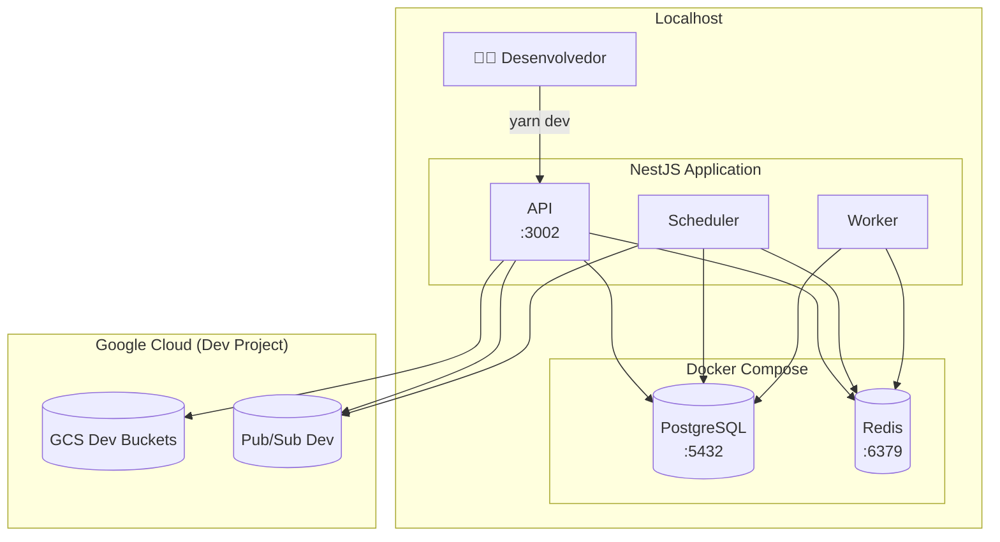
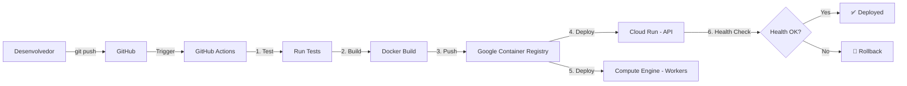

# Diagrama de Deployment

## 📖 Visão Geral

Arquitetura de deployment mostrando como os componentes são distribuídos em ambientes de desenvolvimento e produção.

## 🏭 Arquitetura de Deployment - Produção (GCP)

```mermaid
graph TB
    subgraph "Internet"
        Users[👥 Usuários]
        CDN[Cloud CDN]
    end

    subgraph "Google Cloud Platform - Região: us-central1"
        subgraph "Compute"
            subgraph "Cloud Run - API Service"
                API1[API Instance 1]
                API2[API Instance 2]
                API3[API Instance N]
            end
            
            subgraph "Cloud Run - Scheduler Service"
                Sched1[Scheduler Instance]
            end
            
            subgraph "Compute Engine - Workers"
                Worker1[Worker VM 1]
                Worker2[Worker VM 2]
                Worker3[Worker VM N]
            end
        end
        
        subgraph "Load Balancer"
            LB[Cloud Load Balancer]
        end
        
        subgraph "Messaging"
            PubSub[(Google Pub/Sub)]
        end
        
        subgraph "Storage"
            GCSRaw[(Cloud Storage<br/>videos-raw)]
            GCSProc[(Cloud Storage<br/>videos-processed)]
        end
        
        subgraph "Database"
            CloudSQL[(Cloud SQL<br/>PostgreSQL)]
        end
        
        subgraph "Cache & Queue"
            Memorystore[(Cloud Memorystore<br/>Redis)]
        end
        
        subgraph "Monitoring"
            Monitoring[Cloud Monitoring]
            Logging[Cloud Logging]
            ErrorReporting[Error Reporting]
        end
        
        subgraph "Analytics"
            BigQuery[(BigQuery)]
        end
    end

    %% Fluxo de Tráfego
    Users -->|HTTPS| CDN
    CDN --> LB
    LB --> API1
    LB --> API2
    LB --> API3
    
    %% Conexões da API
    API1 --> GCSRaw
    API1 --> PubSub
    API1 --> CloudSQL
    API2 --> GCSRaw
    API2 --> PubSub
    API2 --> CloudSQL
    API3 --> GCSRaw
    API3 --> PubSub
    API3 --> CloudSQL
    
    %% Conexões do Scheduler
    PubSub --> Sched1
    Sched1 --> Memorystore
    Sched1 --> CloudSQL
    
    %% Conexões dos Workers
    Memorystore --> Worker1
    Memorystore --> Worker2
    Memorystore --> Worker3
    Worker1 --> GCSRaw
    Worker1 --> GCSProc
    Worker1 --> CloudSQL
    Worker2 --> GCSRaw
    Worker2 --> GCSProc
    Worker2 --> CloudSQL
    Worker3 --> GCSRaw
    Worker3 --> GCSProc
    Worker3 --> CloudSQL
    
    %% Monitoramento
    API1 -.->|Métricas| Monitoring
    API1 -.->|Logs| Logging
    Sched1 -.->|Métricas| Monitoring
    Worker1 -.->|Métricas| Monitoring
    Worker1 -.->|Analytics| BigQuery
    
    %% Estilos
    classDef compute fill:#e3f2fd,stroke:#2196f3,stroke-width:2px
    classDef storage fill:#f3e5f5,stroke:#9c27b0,stroke-width:2px
    classDef network fill:#fff4e6,stroke:#ff9800,stroke-width:2px
    classDef monitor fill:#e8f5e9,stroke:#4caf50,stroke-width:2px
    
    class API1,API2,API3,Sched1,Worker1,Worker2,Worker3 compute
    class GCSRaw,GCSProc,CloudSQL,Memorystore,BigQuery storage
    class LB,CDN,PubSub network
    class Monitoring,Logging,ErrorReporting monitor
```

## 🔧 Especificações de Deployment

### Cloud Run - API Service

**Configuração:**
```yaml
# cloud-run-api.yaml
apiVersion: serving.knative.dev/v1
kind: Service
metadata:
  name: pixel-queue-api
spec:
  template:
    metadata:
      annotations:
        autoscaling.knative.dev/minScale: "2"
        autoscaling.knative.dev/maxScale: "100"
        autoscaling.knative.dev/target: "80"
    spec:
      containerConcurrency: 80
      containers:
      - image: gcr.io/pixel-queue-project/api:latest
        ports:
        - containerPort: 3002
        env:
        - name: NODE_ENV
          value: "production"
        - name: DATABASE_URL
          valueFrom:
            secretKeyRef:
              name: database-url
              key: url
        - name: REDIS_HOST
          value: "10.0.0.3"
        resources:
          limits:
            cpu: "2"
            memory: "2Gi"
```

**Características:**
- Auto-scaling: 2-100 instâncias
- Concorrência: 80 requests/instância
- CPU: 2 vCPU
- RAM: 2 GB
- Cold start: ~2s

### Cloud Run - Scheduler Service

**Configuração:**
```yaml
# cloud-run-scheduler.yaml
apiVersion: serving.knative.dev/v1
kind: Service
metadata:
  name: pixel-queue-scheduler
spec:
  template:
    metadata:
      annotations:
        autoscaling.knative.dev/minScale: "1"
        autoscaling.knative.dev/maxScale: "3"
    spec:
      containers:
      - image: gcr.io/pixel-queue-project/scheduler:latest
        env:
        - name: NODE_ENV
          value: "production"
        resources:
          limits:
            cpu: "1"
            memory: "1Gi"
```

**Características:**
- Instâncias fixas: 1-3
- CPU: 1 vCPU
- RAM: 1 GB
- Always-on (minScale: 1)

### Compute Engine - Workers

**Configuração:**
```bash
# Managed Instance Group
gcloud compute instance-groups managed create pixel-queue-workers \
  --base-instance-name=worker \
  --template=worker-template \
  --size=3 \
  --region=us-central1

# Auto-scaling
gcloud compute instance-groups managed set-autoscaling pixel-queue-workers \
  --max-num-replicas=20 \
  --min-num-replicas=3 \
  --target-cpu-utilization=0.7 \
  --region=us-central1
```

**Machine Type:** n2-standard-4
- **vCPUs:** 4
- **RAM:** 16 GB
- **Disco:** 100 GB SSD
- **FFmpeg:** Pré-instalado
- **Concorrência:** 5 jobs simultâneos

**Auto-scaling:**
- Mínimo: 3 VMs
- Máximo: 20 VMs
- Target: 70% CPU

### Cloud SQL - PostgreSQL

**Configuração:**
```bash
gcloud sql instances create pixel-queue-db \
  --database-version=POSTGRES_16 \
  --tier=db-custom-4-16384 \
  --region=us-central1 \
  --backup-start-time=03:00 \
  --enable-bin-log \
  --database-flags=max_connections=200
```

**Especificações:**
- **Tier:** db-custom-4-16384
- **vCPUs:** 4
- **RAM:** 16 GB
- **Storage:** 100 GB SSD (auto-expand)
- **Backup:** Diário às 3h
- **High Availability:** Sim (Failover automático)

### Cloud Memorystore - Redis

**Configuração:**
```bash
gcloud redis instances create pixel-queue-redis \
  --size=10 \
  --region=us-central1 \
  --tier=standard \
  --redis-version=redis_7_0
```

**Especificações:**
- **Tier:** Standard (HA)
- **Memory:** 10 GB
- **Versão:** Redis 7.0
- **Replicação:** Automática

### Google Cloud Storage

**Buckets:**
```bash
# Raw videos (lifecycle: 30 dias)
gsutil mb -c STANDARD -l us-central1 gs://pixel-queue-videos-raw

# Processed videos (lifecycle: permanente)
gsutil mb -c STANDARD -l us-central1 gs://pixel-queue-videos-processed
```

**Especificações:**
- **Classe:** Standard
- **Região:** us-central1
- **Lifecycle (raw):** Delete após 30 dias
- **Versioning:** Desabilitado
- **Public Access:** Não

## 💻 Arquitetura de Deployment - Desenvolvimento Local



**Comandos:**
```bash
# Subir infraestrutura local
docker-compose -f infra/docker-compose.dev.yaml up -d

# Rodar aplicação
yarn dev

# Acesso:
# - API: http://localhost:3002/graphql
# - PostgreSQL: localhost:5432
# - Redis: localhost:6379
```

## 🚀 CI/CD Pipeline



**GitHub Actions Workflow:**
```yaml
# .github/workflows/deploy.yml
name: Deploy to GCP

on:
  push:
    branches: [main]

jobs:
  deploy:
    runs-on: ubuntu-latest
    steps:
      - uses: actions/checkout@v3
      
      - name: Setup Cloud SDK
        uses: google-github-actions/setup-gcloud@v1
        
      - name: Build Docker Image
        run: docker build -t gcr.io/pixel-queue-project/api:${{ github.sha }} .
        
      - name: Push to GCR
        run: docker push gcr.io/pixel-queue-project/api:${{ github.sha }}
        
      - name: Deploy to Cloud Run
        run: |
          gcloud run deploy pixel-queue-api \
            --image gcr.io/pixel-queue-project/api:${{ github.sha }} \
            --region us-central1 \
            --platform managed
```

## 📊 Monitoramento e Observabilidade

### Métricas Coletadas

| Componente | Métricas |
|------------|----------|
| **API** | Request/s, Latência, Erros 4xx/5xx, CPU, Memory |
| **Scheduler** | Pub/Sub messages/s, BullMQ jobs added/s |
| **Workers** | Jobs processed/s, Processing time, FFmpeg errors |
| **Redis** | Memory usage, Commands/s, Hit rate |
| **PostgreSQL** | Connections, Query time, Deadlocks |
| **GCS** | Requests/s, Bandwidth, Errors |

### Alertas Configurados

```yaml
# Cloud Monitoring Alerts
alerts:
  - name: "API High Error Rate"
    condition: error_rate > 5%
    duration: 5m
    notification: slack, email
    
  - name: "Worker Queue Backlog"
    condition: queue_size > 10000
    duration: 10m
    notification: slack
    
  - name: "Database CPU High"
    condition: cpu_utilization > 80%
    duration: 5m
    notification: email
    
  - name: "Circuit Breaker Open"
    condition: breaker_state == "OPEN"
    duration: 1m
    notification: slack, pagerduty
```

## 💰 Estimativa de Custos (Produção)

| Serviço | Especificação | Custo/mês |
|---------|---------------|-----------|
| Cloud Run API | 2-100 instâncias | ~$300 |
| Compute Engine Workers | 3-20 VMs n2-standard-4 | ~$500 |
| Cloud SQL PostgreSQL | db-custom-4-16384 | ~$350 |
| Cloud Memorystore Redis | 10 GB Standard | ~$250 |
| Cloud Storage | 1 TB | ~$20 |
| Pub/Sub | 1M mensagens/dia | ~$40 |
| Cloud CDN | 1 TB egress | ~$80 |
| Cloud Monitoring | Logs + Métricas | ~$50 |
| **TOTAL ESTIMADO** | | **~$1,590/mês** |

## 🔐 Segurança

### Network Security
- VPC peering entre serviços
- Cloud Armor para DDoS protection
- HTTPS obrigatório (TLS 1.3)
- IP whitelisting para admin

### Secrets Management
- Secret Manager para credenciais
- IAM roles granulares
- Service accounts dedicados
- Rotação automática de secrets

### Data Protection
- Encryption at rest (GCS, Cloud SQL)
- Encryption in transit (TLS)
- Backup automático (Cloud SQL)
- Disaster recovery plan

## 🚀 Próximos Passos

- [Ver Fluxo Completo](./flow.md)
- [Componentes](./components.md)
- [Setup Local](../guides/00-setup.md)

