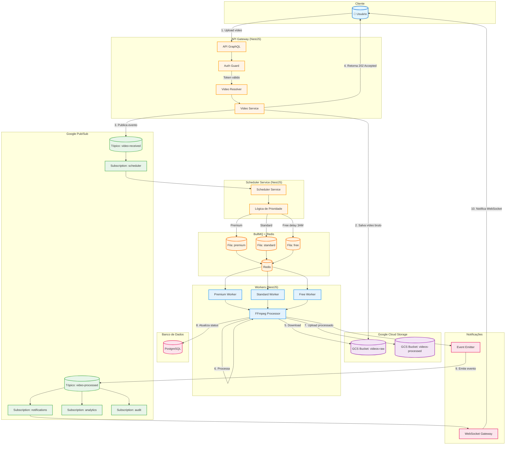
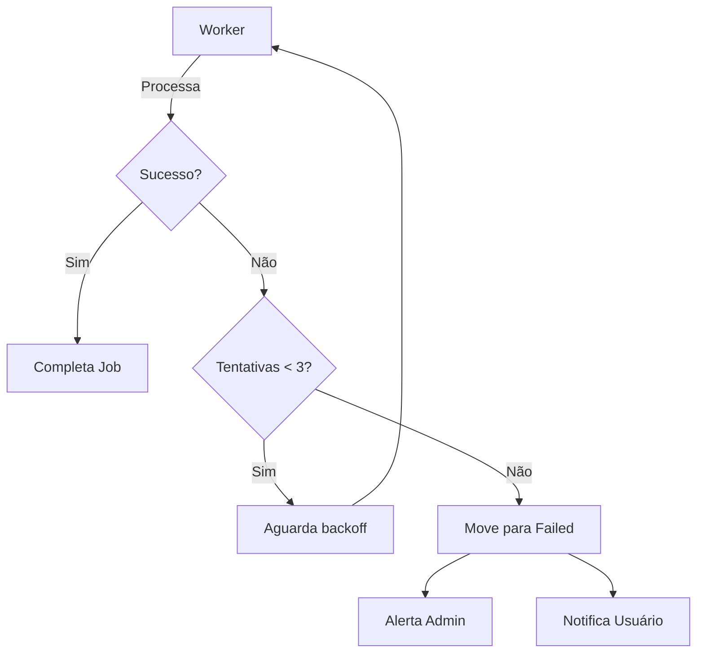
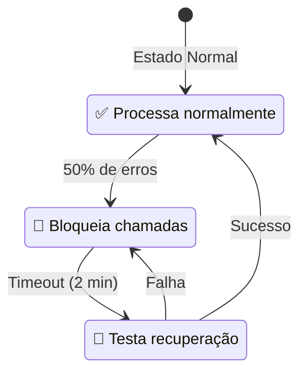
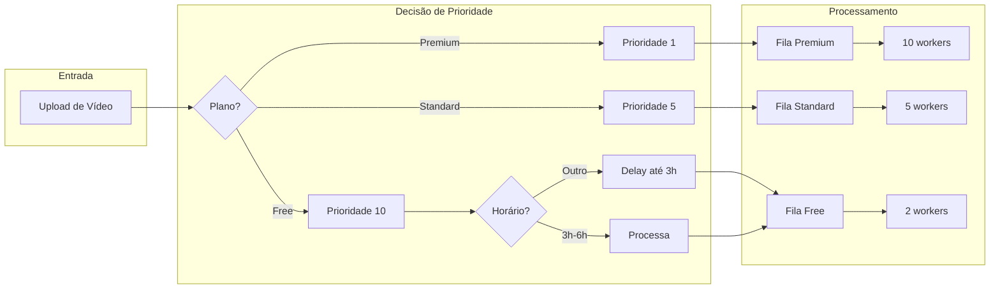
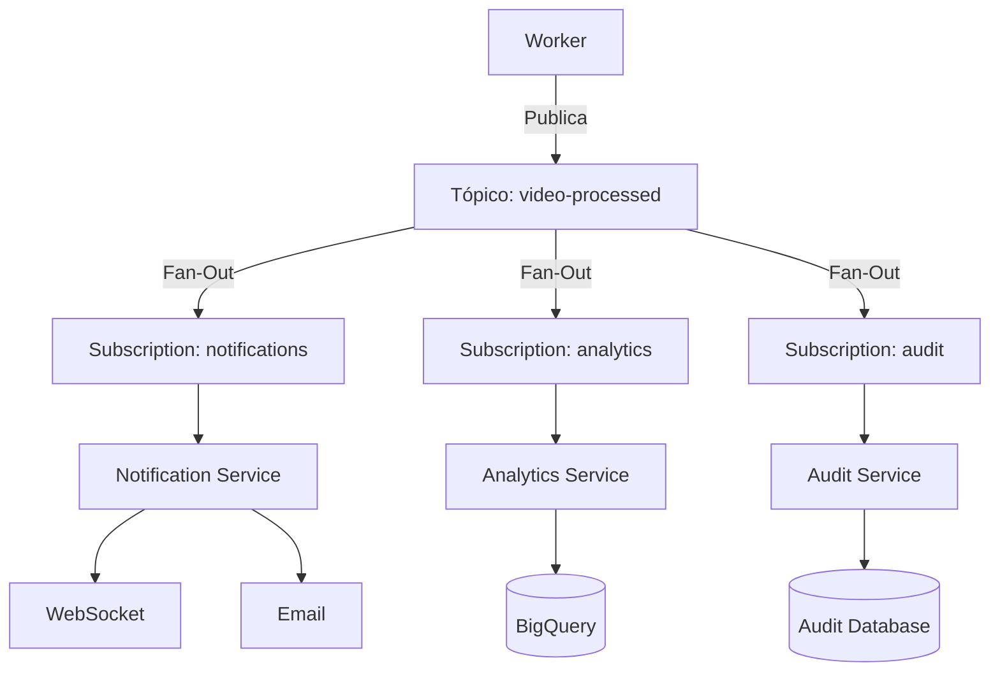
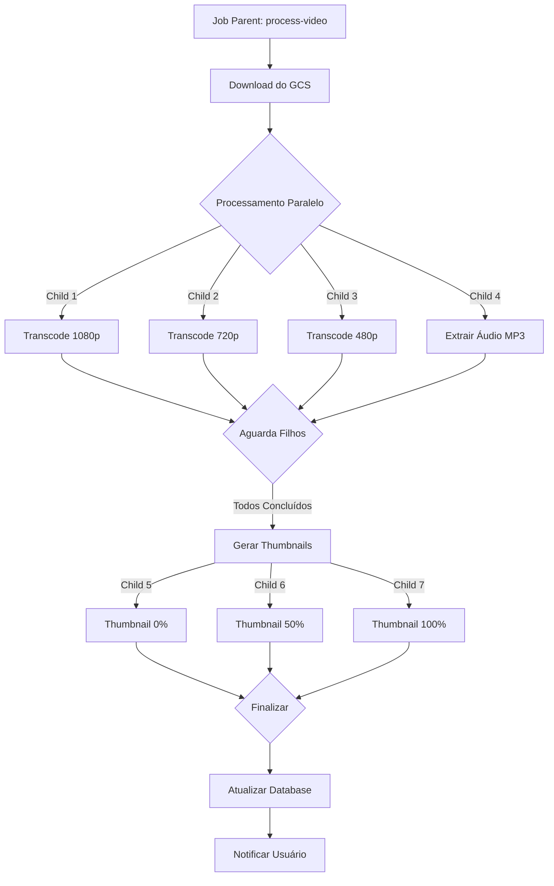

# Diagrama de Fluxo Completo

## 📖 Visão Geral

Diagrama Mermaid mostrando o fluxo completo de processamento de vídeos na arquitetura híbrida Pub/Sub + BullMQ.

## 🔄 Fluxo Principal

## 📊 Detalhamento por Etapa

### Etapa 1-4: Ingestão (API → Pub/Sub)
- Usuário faz upload via GraphQL
- API valida autenticação
- Vídeo salvo no GCS raw
- Evento publicado no Pub/Sub
- Resposta rápida (202) ao usuário

### Etapa 5: Agendamento (Pub/Sub → BullMQ)
- Scheduler escuta subscription
- Aplica lógica de prioridade baseada em:
  - Plano do usuário (FREE/STANDARD/PREMIUM)
  - Tamanho do arquivo
  - Horário do dia
- Adiciona job na fila apropriada

### Etapa 6-8: Processamento (Workers)
- Worker pega job da fila
- Download do vídeo bruto
- Processamento com FFmpeg
- Upload do vídeo processado
- Atualização do status no PostgreSQL

### Etapa 9-10: Notificação
- Worker emite evento de conclusão
- Pub/Sub distribui para múltiplos subscribers
- WebSocket notifica usuário em tempo real

## 🔀 Fluxo de Retentativas

## 🚦 Fluxo de Circuit Breaker

## 📈 Fluxo de Prioridades

## 🌐 Fluxo de Fan-Out

## 🔄 Fluxo de Workflow (Jobs em Cadeia)

## 🚀 Próximos Passos

- [Diagrama de Componentes](./components.md)
- [Diagrama de Deployment](./deployment.md)
- [Voltar para Arquitetura](../architecture/hybrid-flow.md)

